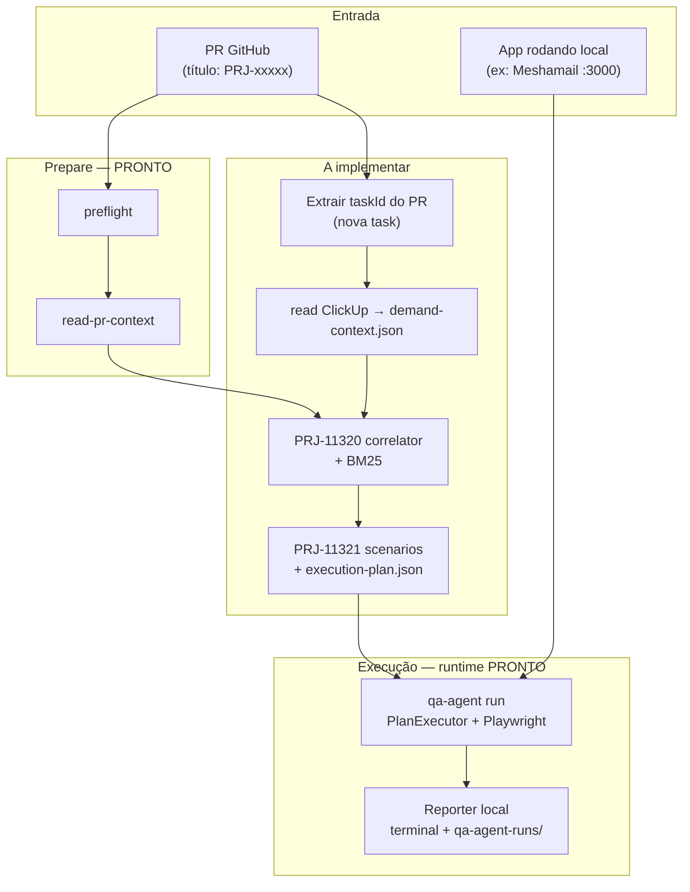

# Roadmap V1 — teste real local (sem sandbox)

> **Objetivo:** fechar um fluxo **ponta a ponta na máquina do dev** — task ClickUp → diff do PR → memória BM25 → cenário → Playwright → relatório no terminal — **antes** de sandbox de preview e **antes** de GitHub App/bot dedicado.  
> **Epic raiz:** [PRJ-11270 — Agente de QA](https://app.clickup.com/t/86ahkfu1v) → [PRJ-11271 — Back-end](https://app.clickup.com/t/86ahm80dr)  
> **Referência de estado:** `.cursor/memory/progress.md` (2026-05-26)

---

## Resumo executivo

| Métrica | Valor |
|--------|-------|
| **Progresso V1 local** (sem sandbox, sem GH Actions produtivo) | **~82%** |
| **Progresso V1 completa** (+ workflow GHA + comentário no PR) | **~77%** |
| **Epic pai mínima para o teste integrado desejado** | até **PRJ-11321** (PRJ-11552 concluída) |
| **Gate formal de “V1 fechada”** | **PRJ-11324** (subset local primeiro, GHA depois) |

A V1 **não** exige sandbox (deploy preview por PR). O app alvo roda **localmente** (`localhost` ou ambiente que o dev sobe) enquanto o agent-qa lê demanda/diff/memória e executa Playwright na URL configurada.

---

## Definição de V1 (escopo fechado)

### Dentro da V1

1. **PR real ou simulado** com metadados GitHub (`GITHUB_*`, `GITHUB_EVENT_PATH`) — local ou CI.
2. **Task ID extraído do PR** (título/corpo no padrão Mesha, ex. `PRJ-11550 — …`) — **não** depender de `CLICKUP_TASK_ID` fixo na `.env`.
3. **Leitura ClickUp** → `demand-context.json` (critérios de aceite, bug opcional).
4. **Diff git** → `pr-diff-context.json` (`affectedRoutes`, `changedFiles`, etc.).
5. **Correlator** → `required-scenarios.json` + `correlation-report.md` (memória BM25 + diff + demanda).
6. **Seleção/plano** → `execution-plan.json` consumível pelo runtime.
7. **Execução Playwright** contra app **já rodando** na máquina (Meshamail local ou outro).
8. **Saída auditável local** — relatório/evidências no terminal e em `./qa-agent-runs/` (fallback antes de comentário no PR).
9. **Preflight gate** via `pipeline prepare` antes de ler diff.

### Fora da V1 (fases posteriores)

| Item | Motivo |
|------|--------|
| **Sandbox / preview deploy** | Diff ≠ deploy; exige infra separada (micro-Vercel, branch checkout, URL efêmera). |
| **GitHub App / Mesha bot** | Limite de **1 webhook** no bot existente; V1 usa **GitHub Actions como provider** (`GITHUB_TOKEN`), não bot paralelo. |
| **Webhook multi-repo** | Fase 2: GHA dispara workflow; webhook org-wide fica para integração ClickUp/GitHub centralizada. |
| **Auth profiles multi-ambiente** | Próxima sprint — perfis `staging`/`prod`/`local` no config; hoje um `auth` por config. |
| **Learning extractor / risk score produtivo** | PRJ-11323 — pós primeiras runs reais documentadas. |

---

## Percentual por task pai (contribuição na V1)

Pesos refletem **quanto cada epic desbloqueia o teste real integrado**, não só “código merged”.

| Task pai | Nome | Status ClickUp | Código | Peso V1 | Concluído | Contribuição |
|----------|------|----------------|--------|---------|-----------|--------------|
| **PRJ-11286** | Tool Registry base | desenvolvido | ✅ | 8% | 100% | **8%** |
| **PRJ-11294** | Tools macros / runtime | desenvolvido | ✅ | 7% | 100% | **7%** |
| **PRJ-11315** | Memória BM25 | desenvolvido | ✅ | 5% | 100% | **5%** |
| **PRJ-11316** | Onboarding + baseline smoke | desenvolvido | ✅ | 5% | 100% | **5%** |
| **PRJ-11317** | Preflight CI/secrets | desenvolvido | ✅ | 8% | 100% | **8%** |
| **PRJ-11318** | Leitor ClickUp | desenvolvido | ✅ | 10% | 100% | **10%** |
| **PRJ-11319** | Leitor PR/diff GHA | desenvolvido | ✅ | 10% | 100% | **10%** |
| **PRJ-11550** | `pipeline prepare` (gate) | desenvolvido | ✅ | 2% | 100% | **2%** |
| **PRJ-11320** | Correlator demanda/diff/memória | desenvolvido | ✅ | 15% | 100% | **15%** |
| **PRJ-11321** | Cenários + ExecutionPlan pipeline | backlog | ⚠️ parcial* | 15% | ~25% | **~4%** |
| **PRJ-11322** | Reporter PR (+ fallback local) | backlog | ⚠️ parcial** | 5% | ~35% | **~2%** |
| **PRJ-11323** | Learning / risk scoring | backlog | ❌ | 3% | 0% | **0%** |
| **PRJ-11324** | Validação E2E produtiva | backlog | ❌ | 5% | 0% | **0%** |
| **PRJ-11552** | Extrair task ID do PR (não `.env`) | desenvolvido | ✅ | 5% | 100% | **5%** |
| **(nova)** | Orquestração `pipeline run` local | **a criar** | ❌ | 2% | 0% | **0%** |
| **(fase 2)** | Workflow `.github/workflows/` + comentário PR | backlog | ❌ | 8% | 0% | **0%** |

\* `ScenarioPlannerService`, `ExecutionPlanPlannerService`, `PlanExecutorService` existem no runtime `qa-agent run`, mas **não** estão ligados ao pipeline PR (`required-scenarios.json` → plano → run).

\*\* `report`, `inspect`, evidências de run existem; falta **reporter de pipeline** que agregue correlação + run + formate saída PR/local.

### Totais

```
Soma concluída (local V1):  8+7+5+5+8+10+10+2+15+5+4+2 ≈ 81%  → arredondado ~82%
Soma concluída (V1 + GHA):  ~77% + 0% (GHA) ≈ 77–87% dependendo do workflow mínimo
Gap restante para teste integrado local: ~18%  (= PRJ-11321 + orchestration `pipeline run`)
```

---

## Até qual task pai dá para testar **hoje**?

### ✅ Testável agora (comandos isolados)

| Epic | Como testar | Artefato / comando |
|------|-------------|-------------------|
| **PRJ-11317** | Preflight produtivo | `qa-agent preflight --output-dir ./.agent-qa/pipeline` |
| **PRJ-11550** | Gate prepare | `qa-agent pipeline prepare --output-dir ./.agent-qa/pipeline` |
| **PRJ-11318** | Demanda ClickUp | `config.clickup.taskId` + `CLICKUP_TOKEN` em run manual; pipeline usa ID do PR |
| **PRJ-11319** | Diff PR | Simular `GITHUB_*` + `qa-agent read-pr-context --output-dir …` |
| **PRJ-11320** | Correlator | `qa-agent pipeline correlate --output-dir ./.agent-qa/pipeline` (após prepare) |
| **PRJ-11315** | Memória | tool `qa.memory.search` / planner com `memoryContext` |
| **PRJ-11316** | Readiness Meshamail | `qa-agent onboarding --config ./agent-qa.meshamail.config.json` |
| **Runtime** | Run manual com demanda no config | `qa-agent run --config ./agent-qa.meshamail.config.json` |

### ❌ Ainda **não** testável como fluxo único

| Epic | Bloqueio |
|------|----------|
| **PRJ-11321** | Sem `ScenarioSelector` / `ExecutionPlanBuilder` de pipeline |
| **PRJ-11322** | Sem publicação agregada pós-pipeline (só run isolado) |
| **PRJ-11324** | Depende de todos acima |

**Conclusão:** hoje você testa **prepare** (preflight + diff) + **correlate** (demanda + diff + memória → cenários) + **run manual** com config estático. O salto para fluxo integrado exige fechar **PRJ-11321** e a **orquestração `pipeline run`**.

---

## Fluxo alvo V1 (local)



### Simulação local do PR (sem GHA)

1. Branch com commits vs `origin/main`.
2. Exportar variáveis (ou fixture JSON em `GITHUB_EVENT_PATH`):

```bash
export GITHUB_EVENT_NAME=pull_request
export GITHUB_BASE_REF=main
export GITHUB_HEAD_REF=feature/minha-demanda
export GITHUB_REF=refs/pull/999/merge
export GITHUB_EVENT_PATH=./test/fixtures/pull-request-event.json  # criar fixture
export CLICKUP_TOKEN=...
export GITHUB_TOKEN=...   # opcional; preflight só warning
# NÃO usar CLICKUP_TASK_ID fixo na .env na V1 final — vem do título do PR
```

3. `qa-agent pipeline prepare --output-dir ./.agent-qa/pipeline`
4. *(futuro)* `qa-agent pipeline correlate|plan|run --config ./agent-qa.meshamail.config.json`

---

## Roadmap recomendado (ordem)

### Fase 0 — **Hoje (~62%)** ✅

Epics PRJ-11315 → PRJ-11319 + PRJ-11550 + runtime v0.2.

**Entrega:** artefatos `preflight-report.json`, `pr-diff-context.json`, run manual Meshamail.

### Fase 1 — **PRJ-11552** Task ID do PR — +5%

Subtask [PRJ-11552](https://app.clickup.com/t/86ahqtz12) (filha de PRJ-11319) — **backlog**, estimativa **10 min** (mesmo padrão PRJ-11380/11366):

- **Nome:** `Extrair CLICKUP task ID do título/corpo do PR`
- **Regras:** regex `PRJ-\d+` (custom ID ClickUp); prioridade título > corpo; falha `BLOCKED` se ausente; **proibir** depender só de `.env` no pipeline produtivo.
- **Saída:** campo em `PullRequestContext` ou `pipeline-context.json`.

> Alinha com decisão: *“task id não pode ficar na .env”* — preflight ainda pode validar token ClickUp, mas o **ID vem do PR**.

### Fase 2 — **PRJ-11320** Correlator — +15%

Subtasks PRJ-11392 … PRJ-11405 (14 itens, todos backlog).

**Entrega mínima V1:** `required-scenarios.json`, `correlation-report.md`, uso de `qa.memory.search`.

**Gate:** entrada incompleta → `BLOCKED`, não inventar cenário (critério da epic).

### Fase 3 — **PRJ-11321** Cenários + plano — +11% (completar os 15%)

**Entrega:** `selected-scenarios.json`, `execution-plan.json` ligados ao `RunAgentUseCase` / `PlanExecutorService`.

**Teste local Meshamail:** app no ar + plano derivado dos critérios de aceite da task ClickUp + rotas do diff.

### Fase 4 — **Reporter local (subset PRJ-11322)** — +3%

Antes do comentário no PR:

- Markdown/JSON no terminal (simular “mensagem de bug”).
- Artefatos em `.agent-qa/pipeline/` + link para `qa-agent-runs/<run-id>/`.

### Fase 5 — **PRJ-11324 subset local** — marcar V1 local fechada

Checklist adaptado de PRJ-11444–11461, **sem** GHA:

- [ ] Task ClickUp real ligada ao PR (ID no título)
- [ ] `pipeline prepare` PASS
- [ ] Correlação + plano + run
- [ ] Evidências + relatório local
- [ ] Limitações documentadas

### Fase 6 — **GitHub Actions (pós-V1 local)** — +8–10%

- Workflow `pull_request` no repo alvo (ou qa-agent como reusable workflow).
- `GITHUB_TOKEN` para checkout + comentário (não GitHub App bot).
- Playwright no runner CI **ou** self-hosted runner apontando para URL acessível.
- Retorno: status check + comentário PR (PRJ-11322 completo).

**Webhook:** org recebe eventos de PR → dispara workflow; **não** compete com webhook único do Mesha bot.

---

## Teste real Meshamail (V1 local) — roteiro prático

### Pré-requisitos

| Item | Onde |
|------|------|
| Config | `agent-qa.meshamail.config.json` |
| Credenciais | `MESHA_EMAIL`, `MESHA_PASSWORD`, `GROQ_PROVIDER` (ou `fake` para smoke) |
| Memória | `.agent-qa/memory.md` — enriquecer rotas/locators Meshamail pós-onboarding |
| ClickUp | Task com critérios de aceite no padrão parser (seções PRJ-11368+) |
| PR | Título `PRJ-xxxxx — descrição` na branch do Meshamail |

### Passos (estado atual + pós-implementação)

```bash
# 1. Subir Meshamail local (repo do produto)
npm run dev   # URL alinhada ao baseUrl do config

# 2. No repo qa-agent (ou monorepo) — prepare
qa-agent pipeline prepare --output-dir ./.agent-qa/pipeline

# 3. Hoje: run manual com demanda estática no config
qa-agent run --config ./agent-qa.meshamail.config.json --headed

# 4. Futuro (pós 11320–11321):
# qa-agent pipeline run --config ./agent-qa.meshamail.config.json \
#   --pipeline-dir ./.agent-qa/pipeline
```

### Simular “mensagem de bug” no terminal

Hoje: `qa-agent report --runs-dir … --run-id … --format md`

Futuro (PRJ-11322): comando único que imprime resumo estilo PR comment (pass/fail, bugs, screenshots paths) **sem** postar no GitHub.

---

## Outro sistema além do Meshamail

Checklist **por projeto alvo** (não é código novo no agent-qa, é onboarding):

| # | Ação | Epic relacionada |
|---|------|------------------|
| 1 | Criar `agent-qa.<projeto>.config.json` (`baseUrl`, `appDomains`, `auth`) | PRJ-11316 |
| 2 | Rodar `qa-agent validate-config` + `qa-agent onboarding` | PRJ-11316 |
| 3 | Popular `.agent-qa/memory.md` — chunks `route`, `flow`, `semantic_locator`, `scenario` | PRJ-11315 |
| 4 | Task ClickUp com critérios de aceite parseáveis | PRJ-11318 |
| 5 | Convenção de PR com `PRJ-xxxxx` no título | **nova task** |
| 6 | Ajustar `allowedRoutes` / smoke destrutivo-safe no config | PRJ-11316 |
| 7 | Secrets: tokens ClickUp + credenciais auth via env (nunca no JSON) | PRJ-11317 |
| 8 | Primeiro `pipeline prepare` no repo do produto com git simulado | PRJ-11319 |

**Estimativa de esforço por novo produto:** ~1–2 dias de onboarding de memória + config (domínio conhecido); correlator/plano são **reutilizados** após PRJ-11320–11321.

---

## Decisões de arquitetura (contexto)

| Tema | Decisão V1 |
|------|------------|
| **Bot vs Actions** | Provider = **GitHub Actions** + `GITHUB_TOKEN`; evitar segundo bot/webhook. |
| **Task ID** | Vem do **PR** (título/corpo `PRJ-xxxxx`); run local usa `config.clickup.taskId`. |
| **CLICKUP_TASK_ID env** | **Removido** — não usar na `.env`. |
| **Playwright onde roda** | V1 local: máquina do dev. V1.1 CI: runner GHA (mesmo binário `qa-agent`). |
| **Sandbox** | Não bloqueia V1; testar contra app que o dev sobe. |
| **Auth profiles** | Uma config por ambiente por enquanto; evoluir para perfis nomeados (próxima sprint). |
| **Mesha bot webhook único** | Webhook org dispara **workflow**, não agent-qa direto como App. |

---

## Mapa visual — epics pai vs V1

```
PRJ-11270 Agente de QA
└── PRJ-11271 Back-end
    ├── PRJ-11286 Tool Registry        ██████████ 100%  (runtime)
    ├── PRJ-11294 Tools macros         ██████████ 100%  (runtime)
    ├── PRJ-11315 BM25                 ██████████ 100%
    ├── PRJ-11316 Onboarding           ██████████ 100%
    ├── PRJ-11317 Preflight            ██████████ 100%
    ├── PRJ-11318 ClickUp              ██████████ 100%
    ├── PRJ-11319 PR/diff + 11550      ██████████ 100%
    ├── PRJ-11320 Correlator           ░░░░░░░░░░   0%  ← próximo
    ├── PRJ-11321 Scenarios/plan       ██░░░░░░░░  25%
    ├── PRJ-11322 Reporter             ███░░░░░░░  35%  (local subset)
    ├── PRJ-11323 Learning             ░░░░░░░░░░   0%  (pós-V1)
    └── PRJ-11324 E2E validation       ░░░░░░░░░░   0%  (gate final)
    
    [PRJ-11552] Task ID do PR           ██████████ 100%
```

---

## Próximas ações concretas

1. **ClickUp:** [PRJ-11552](https://app.clickup.com/t/86ahqtz12) — extrair task ID do PR (backlog, 10 min).
2. **Dev:** implementar **PRJ-11392** (`DemandDiffMemoryCorrelator`) — epic PRJ-11320.
3. **Dev:** encadear **PRJ-11321** (`ExecutionPlanBuilder` de pipeline).
4. **QA:** onboarding Meshamail + memória `.agent-qa/` antes da primeira run correlacionada.
5. **Doc:** após run local bem-sucedida, registrar learning em `.agent-qa/memory.md` (PRJ-11323 light).

---

## Referências

- CLI pipeline: `doc/17-configuration-and-cli.md`
- Memória runtime: `.agent-qa/memory.md`, `.agent-qa/structure.md`
- Progresso implementado: `.cursor/memory/progress.md`
- Epics ClickUp: [PRJ-11271](https://app.clickup.com/t/86ahm80dr), [PRJ-11320](https://app.clickup.com/t/86ahmfx1v), [PRJ-11324](https://app.clickup.com/t/86ahmg55a)
